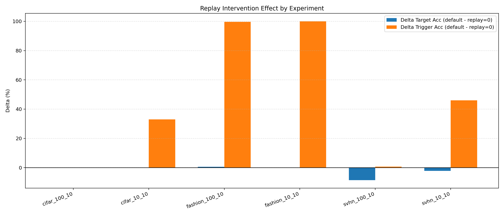
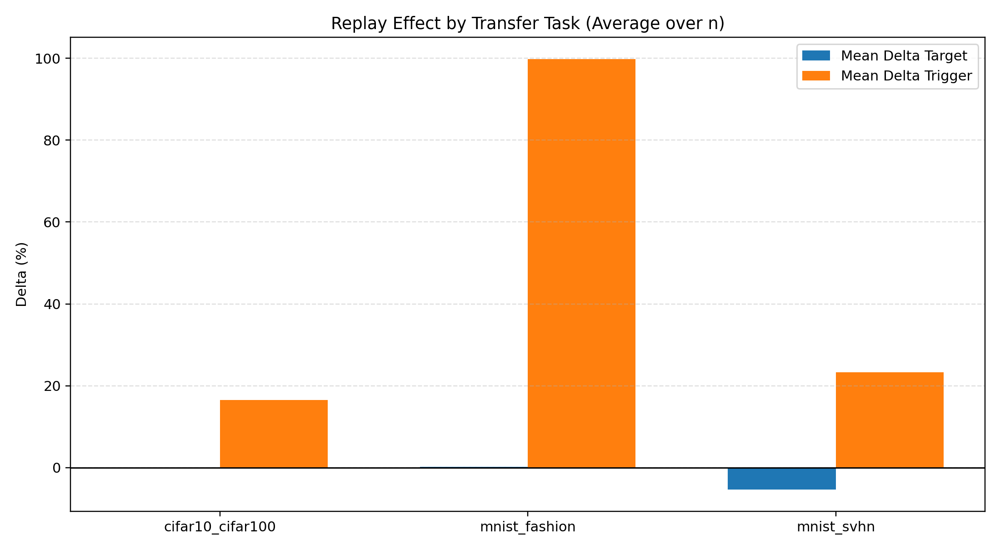
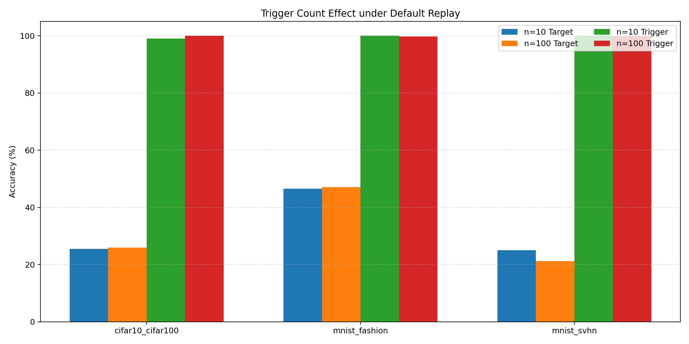

# DNN Watermark Transfer Persistence Experiments

[Switch to 中文](README.md)

This project targets a core question:
Can a backdoor watermark embedded in a pre-trained model survive transfer learning, and what tradeoff emerges between retention and downstream target performance?

Project origin and acknowledgment:
This project is built upon the public repository https://github.com/ghua-ac/dnn_watermark. During the research and implementation process, we also benefited from the guidance and suggestions of Professor HUA GUANG, the project lead.

---

## 1. Research Objectives and Significance

### 1.1 Objectives
- Quantitatively evaluate watermark survival under cross-task transfer.
- Compare trigger retention and target-task accuracy before/after replay intervention.
- Analyze trigger-count effects (n=10 vs n=100) on retention and utility.

### 1.2 Why this matters
- Engineering value: supports a practical "embed once, reuse across tasks" ownership-verification workflow.
- Security value: shows that watermark retention is not naturally stable under transfer and requires explicit mechanisms.
- Methodological value: replay is effective for retention, but may introduce task-dependent utility cost.

---

## 2. Experiment Scope

Current showcased results cover 6 experiment groups across 3 comparison dimensions:

- Transfer-task dimension (3 tasks)
	- MNIST -> SVHN
	- MNIST -> FashionMNIST
	- CIFAR10 -> CIFAR100

- Trigger-scale dimension (2 settings)
	- n=10, m=10
	- n=100, m=10

- Replay dimension (2 settings)
	- replay_zero (replay_ratio=0)
	- replay_default (replay_ratio=0.15)

Total comparison coverage: 3 tasks x 2 scales x 2 replay settings (aggregated in pairwise form).

Additional definitions:
- n: number of trigger groups (how many independent trigger sets are used).
- m: chain length per trigger group.
- Total trigger sample volume: n x m.

---

## 3. Replay Mechanism Deep Dive (Core of This Study)

### 3.1 Why replay is necessary

During transfer learning, gradients from the target task continuously reshape the feature space, which can erode the decision region tied to source-domain triggers.

- Without replay: the model adapts faster to the target task, but watermark pathways drift more easily.
- With replay: trigger samples are revisited periodically, providing persistent correction signals for watermark behavior.

So replay is not mainly a target-accuracy booster; it is a forgetting-control mechanism that makes watermark retention explicitly optimizable.

### 3.2 Optimization objective (intuitive form)

The transfer stage can be interpreted as multi-objective optimization:

$$
\mathcal{L}_{total}=\mathcal{L}_{target}+\lambda_r\mathcal{L}_{replay}+\lambda_f\mathcal{L}_{feature\_anchor}
$$

Where:

- $\mathcal{L}_{target}$: supervised loss for downstream utility.
- $\mathcal{L}_{replay}$: trigger replay loss preserving trigger-response mapping.
- $\mathcal{L}_{feature\_anchor}$: feature anchoring term that limits excessive representation drift.

Key implementation knobs:

- transfer_replay_ratio
- transfer_replay_weight
- transfer_feature_anchor_weight

### 3.3 Replay scheduling strategy in this repository

This project uses a dynamic schedule instead of fixed replay intensity:

1. Warmup ramp:
	replay influence gradually increases according to replay_ramp_ratio to avoid early over-constraint.

2. Sustain mode after full trigger condition:
	once trigger performance reaches trigger_full_threshold, replay is not hard-stopped; low-intensity sustain is kept via replay_sustain_scale_after_full.

3. Rescue mode on degradation:
	if trigger falls below trigger_rescue_threshold, replay intensity is boosted by replay_rescue_scale and held by trigger_rescue_hold_ratio to avoid immediate re-collapse.

4. Adaptive control:
	adaptive_drop_threshold, adaptive_decay, adaptive_growth, and replay_ratio_cap jointly balance retention and utility.

Compared with hard cut-off replay, this schedule is more stable and reduces late-stage retention collapse.

### 3.4 How key parameters affect outcomes

- transfer_replay_ratio: upper bound of replay sample proportion. Too low under-preserves watermark; too high may hurt target utility.
- transfer_replay_weight: relative contribution of replay loss in total optimization.
- transfer_feature_anchor_weight: regularizes representation drift and improves replay stability.
- trigger_full_threshold / trigger_rescue_threshold: state-switch boundaries for sustain and rescue.
- replay_ratio_cap: prevents adaptive replay from growing excessively and damaging target performance.

Suggested tuning order:

1. Fix learning rate and freeze policy first.
2. Coarsely tune replay_ratio, then fine-tune replay_weight.
3. Finally tune threshold/rescue parameters for late-stage stabilization.

### 3.5 Evidence from current experiments

From the 6 experiment groups in this repository:

- Delta Trigger is non-negative in 6/6 settings, indicating stable retention gain from replay.
- For MNIST -> FashionMNIST, replay lifts Z_Trig from 0 to near 100, showing a strong recovery effect.
- For MNIST -> SVHN, replay improves trigger retention while reducing target accuracy in some settings, showing the central tradeoff:
  retention gain and utility gain are not always aligned.

Core takeaway:
replay is not a free gain; it is a controllable knob on the retention-utility frontier.

### 3.6 Key Parameter Quick Reference (Annotated)

| Parameter | Suggested Start | Role | Typical effect when increased | Typical effect when decreased |
|---|---:|---|---|---|
| transfer_replay_ratio | 0.15 | Replay sample proportion | Better trigger stability, possible target drop | Better target fit, higher retention risk |
| transfer_replay_weight | 0.25 | Replay loss weight | Stronger watermark constraint, more conservative optimization | Weaker replay signal, easier late forgetting |
| transfer_feature_anchor_weight | 0.02 | Feature anchoring strength | Less representation drift, possibly slower transfer | More aggressive transfer, weaker trigger stability |
| transfer_trigger_full_threshold | 0.999 | Sustain-mode entry threshold | Later sustain entry, more cautious training | Earlier sustain entry, possible premature relaxation |
| transfer_trigger_rescue_threshold | 0.97 | Rescue trigger threshold | More frequent rescue, stronger retention | Fewer rescues, higher late-stage fallback risk |
| transfer_replay_rescue_scale | 0.35 | Replay boost during rescue | Faster recovery, more target disturbance | Slower recovery, possible under-rescue |
| transfer_replay_ratio_cap | 0.06 | Upper bound for adaptive replay | Higher cap may suppress target performance | Lower cap may fail to prevent forgetting |

Practical tuning rule:
- If trigger drops: increase transfer_replay_ratio or transfer_replay_weight first.
- If target accuracy drops too much: reduce transfer_replay_ratio first, then tune anchor and thresholds.

### 3.7 Why n and m are critical (detailed)

These are not just dataset-size knobs; they define watermark structural complexity.

1. Role of n: controls coverage
- Larger n increases trigger-set diversity, making it harder to pass verification by memorizing only a few patterns.
- Smaller n reduces cost and speeds up convergence, but may increase overfitting to limited trigger modes.
- Under transfer, larger n often improves retention robustness, but does not guarantee better target accuracy.

2. Role of m: controls chain depth
- m defines how long each trigger chain is inside one group.
- Larger m strengthens chain-consistency constraints and requires stronger representation continuity.
- Smaller m weakens chain constraints, easing optimization but potentially reducing anti-drift robustness.

3. Coupled impact of n and m
- Increasing both n and m effectively scales watermark constraints with n x m.
- Stronger constraints usually favor retention, but increase compute cost and the chance of conflict with target-task optimization.
- Therefore n and m should be tuned jointly with replay_ratio and replay_weight.

4. Practical suggestions for this repository
- For quick pipeline validation: start with n=10, m=10.
- For stronger watermark stress testing: start with n=100, m=10.
- If trying larger m, reduce replay_ratio or learning rate first to avoid over-constraint in early training.

---

## 4. Repository Structure (Reproducibility-related)

- Main training entrypoint: DNN_Watermark-master/kaggle_main.py
- Final experiment outputs: final_results/
- README summary figures/data: docs/figures/
- Auto-aggregation script for README: scripts/generate_readme_figures.py

---

## 5. Quick Start (for GitHub Visitors)

### 5.1 View final results directly (no training required)
1. Read the table and findings in this page.
2. Open figures:
	 - docs/figures/replay_effect_by_experiment.png
	 - docs/figures/replay_effect_by_task.png
	 - docs/figures/trigger_count_effect.png
3. Inspect aggregated metrics: docs/figures/experiment_summary.json

### 5.2 Regenerate README figures from final_results

Run from repository root:

```bash
python scripts/generate_readme_figures.py \
	--final_results final_results \
	--out docs/figures
```

Outputs:
- experiment_summary.json
- replay_effect_by_experiment.png
- replay_effect_by_task.png
- trigger_count_effect.png

---

## 6. How to Run Full Experiments (Training to Verification)

These commands are for rerunning experiments, not just browsing existing outputs.

### 6.1 Environment setup

```bash
pip install torch torchvision torchaudio matplotlib pandas tqdm opendatasets
```

Recommended working directory for training commands: DNN_Watermark-master.

### 6.2 Recommended reproduction workflow (single entrypoint)

Use kaggle_main.py as unified entrypoint:

```bash
# Core flow: baseline -> embed -> transfer(replay_zero + replay_default) -> verify
cd DNN_Watermark-master
python kaggle_main.py \
	--pipeline_step full_compare \
	--dataset_index 0 \
	--embed_mode 8 \
	--transfer_task mnist_svhn \
	--n 100 \
	--m 10 \
	--batch_size 32 \
	--mix 4 \
	--transfer_num_epochs 25 \
	--transfer_learning_rate 0.00005 \
	--transfer_lambda_sp 0.5 \
	--transfer_replay_ratio 0.15 \
	--transfer_replay_weight 0.25 \
	--transfer_feature_anchor_weight 0.02 \
	--transfer_trigger_full_threshold 0.999 \
	--transfer_trigger_rescue_threshold 0.97
```

Parameter notes:
- pipeline_step=full_compare: runs replay=0 first, then default replay for direct comparison.
- embed_mode=8: FixLL+PFL, the primary embedding method in this study.
- transfer_task: transfer pair (e.g., mnist_svhn).
- n: number of trigger groups, controlling watermark coverage and diversity.
- m: trigger chain length per group, controlling chain-consistency constraint strength.
- n x m: total trigger sample volume, directly affecting compute cost and retention pressure.
- transfer_lambda_sp: structure-preserving regularization to reduce excessive drift.
- transfer_replay_ratio: main knob controlling retention-utility balance.
- transfer_replay_weight: relative strength of replay optimization signal.
- transfer_feature_anchor_weight: representation anchoring strength for stability.
- transfer_trigger_full_threshold / rescue_threshold: boundaries for sustain and rescue state transitions.

This command automatically runs:
- baseline/ref training
- watermark embedding
- replay=0 vs replay=default transfer comparison
- verification and result collection

### 6.3 Other Run Modes (All pipeline_step options)

The examples below cover all available pipeline_step options in kaggle_main.py:

```bash
# 1) baseline: train reference model only
python kaggle_main.py --pipeline_step baseline --dataset_index 0 --embed_mode 0 --n 100 --m 10

# 2) embed: watermark embedding only
python kaggle_main.py --pipeline_step embed --dataset_index 0 --embed_mode 8 --n 100 --m 10

# 3) transfer: transfer learning only (requires source model)
python kaggle_main.py --pipeline_step transfer --source_model <SOURCE_MODEL> --transfer_task mnist_svhn

# 4) verify: watermark verification only (requires source + target model)
python kaggle_main.py --pipeline_step verify --source_model <SOURCE_MODEL> --target_model <TARGET_MODEL>

# 5) recovery: verification + recovery analysis (requires source + target model)
python kaggle_main.py --pipeline_step recovery --source_model <SOURCE_MODEL> --target_model <TARGET_MODEL>

# 6) full: run the full pipeline starting from baseline
python kaggle_main.py --pipeline_step full --dataset_index 0 --embed_mode 8 --transfer_task mnist_svhn --n 100 --m 10

# 7) full_compare: full pipeline with replay=0 and replay=default comparison
python kaggle_main.py --pipeline_step full_compare --dataset_index 0 --embed_mode 8 --transfer_task mnist_svhn --n 100 --m 10

# 8) full_from_source: full pipeline from existing source model (skip baseline/embed)
python kaggle_main.py --pipeline_step full_from_source --source_model <SOURCE_MODEL> --transfer_task mnist_svhn --n 100 --m 10
```

Notes:
- `<SOURCE_MODEL>` is typically the embedded source checkpoint (e.g., `trained/MNIST/FixLL+PFL/*.pt`).
- `<TARGET_MODEL>` is typically the transferred target checkpoint (e.g., `trained/transfer_runs/.../*.pt` or your custom save path).

---

## 7. Data Sources and Metric Protocol

This report is aggregated from:
- final_results/results_*/result/*_summary.json
- final_results/results_*/result/watermark_verification_report.json

Metric definitions:
- S_Acc: source test_acc from embedding-stage latest checkpoint (%)
- S_Trig: source trigger_acc (%)
- D_Tgt: transfer target accuracy with default replay (replay_ratio=0.15) (%)
- D_Trig: transfer trigger accuracy with default replay (%)
- Z_Tgt: transfer target accuracy with replay=0 (%)
- Z_Trig: transfer trigger accuracy with replay=0 (%)
- Delta Target: D_Tgt - Z_Tgt (percentage points)
- Delta Trigger: D_Trig - Z_Trig (percentage points)
- Ret_SHS: trigger_accuracy.retention_rate_source_head (ratio in [0,1])
- T_VT_Trig: trigger_accuracy.target_accuracy (%)

---

## 8. Full Comparison Table (Task + Replay + Trigger Count)

| Experiment | Transfer Task | n | m | S_Acc | S_Trig | D_Tgt | D_Trig | Z_Tgt | Z_Trig | Delta Target | Delta Trigger | Ret_SHS | T_VT_Trig |
|---|---|---:|---:|---:|---:|---:|---:|---:|---:|---:|---:|---:|---:|
| results_cifar_100_10 | CIFAR10 -> CIFAR100 | 100 | 10 | 87.11 | 100.0 | 25.93 | 100.0 | 25.93 | 100.0 | 0.00 | 0.0 | 0.976 | 0.0 |
| results_cifar_10_10 | CIFAR10 -> CIFAR100 | 10 | 10 | 86.81 | 100.0 | 25.46 | 99.0 | 25.51 | 66.0 | -0.05 | +33.0 | 0.960 | 0.0 |
| results_fashion_100_10 | MNIST -> FashionMNIST | 100 | 10 | 99.54 | 100.0 | 47.08 | 99.7 | 46.46 | 0.0 | +0.62 | +99.7 | 0.003 | 0.0 |
| results_fashion_10_10 | MNIST -> FashionMNIST | 10 | 10 | 99.41 | 100.0 | 46.52 | 100.0 | 46.73 | 0.0 | -0.21 | +100.0 | 1.000 | 0.0 |
| results_svhn_100_10 | MNIST -> SVHN | 100 | 10 | 99.41 | 100.0 | 21.17 | 99.9 | 29.71 | 99.2 | -8.54 | +0.7 | 1.000 | 0.0 |
| results_svhn_10_10 | MNIST -> SVHN | 10 | 10 | 99.37 | 100.0 | 25.01 | 100.0 | 27.16 | 54.0 | -2.15 | +46.0 | 1.000 | 0.0 |

---

## 9. Visual Comparison

### 9.1 Replay intervention effect by experiment



Reading guide:
- Blue bars: Delta Target.
- Orange bars: Delta Trigger.
- Replay consistently helps trigger retention, but target utility is task-dependent.

### 9.2 Replay effect by transfer task (mean over n)



Reading guide:
- mnist_fashion: strongest trigger gain and slightly positive target gain.
- cifar10_cifar100: moderate trigger gain, near-neutral target change.
- mnist_svhn: trigger gain remains positive, but target accuracy drops.

### 9.3 Trigger count effect (n=10 vs n=100) under default replay



Reading guide:
- CIFAR10->CIFAR100 and MNIST->FashionMNIST show small target improvements at n=100.
- MNIST->SVHN shows target degradation at n=100 (about -3.84), indicating that larger trigger sets are not universally beneficial.

---

## 10. Multi-Angle Findings

### 10.1 By transfer task

| Transfer Task | Mean Delta Target | Mean Delta Trigger | Interpretation |
|---|---:|---:|---|
| CIFAR10 -> CIFAR100 | -0.03 | +16.5 | Replay mainly benefits trigger retention with almost no target gain |
| MNIST -> FashionMNIST | +0.21 | +99.85 | Replay strongly improves trigger and slightly improves target |
| MNIST -> SVHN | -5.35 | +23.35 | Replay improves trigger but introduces clear target cost |

### 10.2 By replay intervention

Core observations:
- In 6/6 experiments, Delta Trigger >= 0.
- In only 2/6 experiments, Delta Target > 0.
- Replay is a robust retention mechanism, not a guaranteed utility booster.

### 10.3 By trigger count (n)

Under default replay, increasing n from 10 to 100 yields:
- CIFAR10->CIFAR100: Target +0.47, Trigger +1.0
- MNIST->FashionMNIST: Target +0.56, Trigger -0.3
- MNIST->SVHN: Target -3.84, Trigger -0.1

Interpretation:
- Trigger count interacts with task shift.
- For harder domain shifts (e.g., SVHN), larger trigger sets can over-constrain representation learning and hurt target utility.

### 10.4 Reason Analysis (Why these findings occur)

1. Domain gap shapes replay outcomes.
- When source and target domains are closer (e.g., MNIST -> FashionMNIST), replay constraints conflict less with target-task gradients, so retention and utility can improve together.
- With larger domain shifts (e.g., MNIST -> SVHN), replay acts as a stronger force to preserve old representations, which conflicts with required target adaptation, producing trigger gains but target drops.

2. Replay is retention-first, not accuracy-first.
- Replay directly optimizes trigger behavior stability, so consistently non-negative Delta Trigger is expected.
- Target accuracy depends on remaining adaptation freedom; if replay constraints are too strong, downstream plasticity is reduced.

3. Larger n x m means denser watermark constraints.
- Increasing n x m raises the number of trigger constraints the model must satisfy, typically improving anti-forgetting behavior.
- But denser constraints also consume optimization capacity for target adaptation, especially under high domain shift.

4. Threshold/rescue policy shapes late-stage dynamics.
- Sustain/rescue scheduling reduces late trigger collapse.
- If rescue triggers too often or too strongly, target curves may fluctuate more, reflecting a tradeoff between retention stability and smooth generalization.

---

## 11. Key Findings and Recovery Discussion

Core findings (phenomenon level):
- Across 6 transfer settings, replay shows consistently positive trigger-retention effects (non-negative Delta Trigger), while target-task impact remains task-dependent.
- Under larger domain shifts (e.g., MNIST->SVHN), the retention-utility tradeoff becomes more visible.

### 11.1 Recovery methods: Affine Inverse + MLP

The recovery module in this project follows two complementary paths:

1. Affine inverse recovery
- Idea: treat transferred features as approximately affine-transformed source features, estimate an inverse mapping, and pull features back toward source-side decision geometry.
- Best for: low-order shifts (scale/rotation/translation-like changes).
- Strength: interpretable, lightweight, geometry-friendly analysis.
- Limitation: limited compensation for strongly nonlinear drift.

2. MLP-based nonlinear recovery
- Idea: use a compact neural mapper to learn transferred-feature -> verifiable-feature recovery under nonlinear drift.
- Best for: larger domain gaps and complex nonlinear feature deformation.
- Strength: stronger expressive power than affine-only correction.
- Limitation: requires additional fitting/validation and is more sensitive to hyperparameters.

### 11.2 What recovery does when replay is already strong

When replay already provides strong retention, recovery shifts from a primary retention mechanism to:

- Fallback: fixing tail failures that replay alone does not fully handle.
- Calibration: reducing head-mismatch effects (signal exists but is not directly readable under another verification head).
- Interpretation: diagnosing drift source and recoverability limits through geometric and nonlinear correction behavior.

In short, replay handles "do not lose it"; recovery handles "if lost, how to restore and explain it".

### 11.3 Current evidence boundary (exploratory)

- In current final_results reports, recovery_analysis still includes runtime errors (`raw_logits` undefined).
- Therefore, recovery is treated as exploratory methodology in this version, and its quantitative gain is not counted as a pillar of main conclusions.

---

## 12. Reproduction Checklist

- Use one consistent trigger configuration (n, m, trigger_file) across embed/transfer/verify.
- Distinguish replay_zero and replay_default result files during comparison.
- Regenerate figures/summary with scripts/generate_readme_figures.py for consistency.
- Report both target utility and trigger retention to avoid one-sided conclusions.

---

## 13. Navigation

- Index: README.md
- Chinese report: README.md
- Figure folder: docs/figures
- Consolidated data: docs/figures/experiment_summary.json
- Figure script: scripts/generate_readme_figures.py
- Training entrypoint: DNN_Watermark-master/kaggle_main.py
- Raw experiment outputs: final_results
